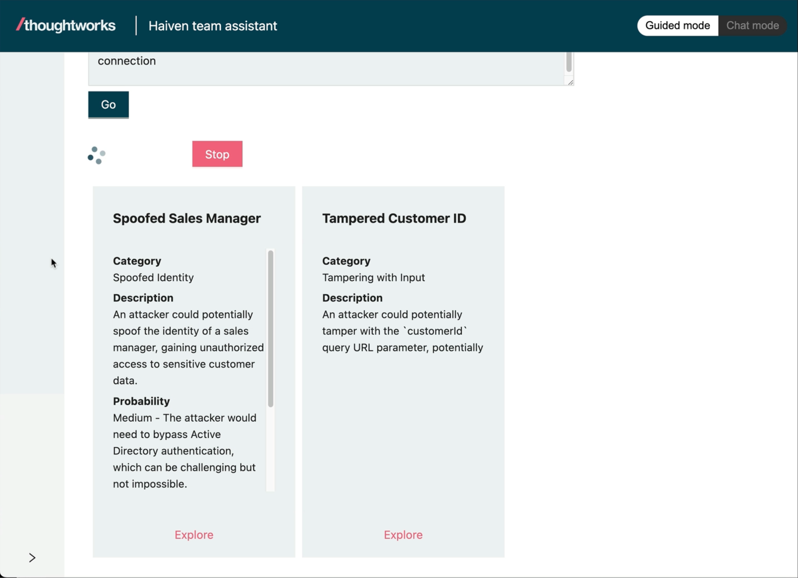
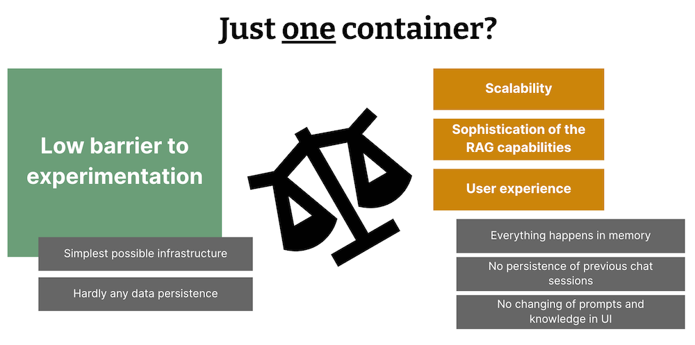

# Haiven team assistant

[Thoughtworks](https://thoughtworks.com) is a global software consultancy working for a wide range of clients. We're using Haiven to offer our clients a **lean way to pilot the use of AI assistance for software delivery teams** while the market of products is still busy and evolving.

## What is it?

A **sandbox to lower the barrier to experiment** with the use of Generative AI assistance for software delivery **tasks beyond coding**. 

- Simple one-container deployment --> **easy to deploy** in your environment
- Integratable with the 3 big cloud provider's model services (Azure OpenAI, Google Gemini, AWS Bedrock) --> choose your existing cloud provider of choice to alleviate at least some of the **data confidentiality concerns** that currently limit many enterprise's choice of product and tool usage
- Separation of application and **"knowledge pack"** to plug in and change your own prompts and domain information --> **customize** to your team

## What is it NOT?

- A product
- A fully fleshed out and scalable tool

## Why?

[More on the why here](docs/why.md), in particular these two questions:
* Why would you use it?
* How does it compare to...?

# Overview


Haiven lets you codify your practices and knowledge and make it available to an AI assistant, to surface it to team members just-in-time when they are working on a task.


## Example "Chat mode"

[Click to see video](https://drive.google.com/file/d/108t7_tyYcwYUSuotSSTViHYBiXmOp2Kk/view?usp=sharing)

[](https://drive.google.com/file/d/108t7_tyYcwYUSuotSSTViHYBiXmOp2Kk/view?usp=sharing)

## Example "Guided mode"

[Click to see video](https://drive.google.com/file/d/105ksKtyfsoC98U_6O2m8gcrYkM4r3pBW/view?usp=sharing)

[](https://drive.google.com/file/d/105ksKtyfsoC98U_6O2m8gcrYkM4r3pBW/view?usp=sharing)

## Quickest way to try it out

Prerequisite:
- Log into the GitHub Container Registry: `echo $CR_PAT | docker login ghcr.io -u USERNAME --password-stdin` ([documentation about how to get a token and authorize yourself here](https://docs.github.com/en/packages/working-with-a-github-packages-registry/working-with-the-container-registry#authenticating-with-a-personal-access-token-classic))

### With Azure OpenAI

- Create a `.env` file with the content of (app/.env.azure.template)[app/.env.azure.template]
- Change the `AZURE_OPENAI_API_KEY` in that file to the API Key - (Thoughtworkers can ask the Haiven team for access to the "trial" Azure OpenAI API Key).

```
mkdir haiven
cd haiven
# Put the .env file into this new folder
git clone git@github.com:tw-haiven/haiven-tw-knowledge-pack.git
# The TW knowledge pack is private, you can use our sample pack if you don't have access
# git clone git@github.com:tw-haiven/haiven-community-knowledge-pack.git
docker run \
        -v ./haiven-tw-knowledge-pack:/app/teams \
        --env-file .env \
        -e AUTH_SWITCHED_OFF=true \
        -e TEAM_CONTENT_PATH=/app/teams \
        -p 8080:8080 \
        ghcr.io/tw-haiven/haiven:main
```

### With Ollama, locally

Prerequisites:
- Install [Ollama](https://ollama.com/).

```
ollama pull llama2
ollama pull llava:7b
mkdir haiven
cd haiven
git clone git@github.com:tw-haiven/haiven-tw-knowledge-pack.git
# The TW knowledge pack is private, you can use our sample pack if you don't have access
# git clone git@github.com:tw-haiven/haiven-community-knowledge-pack.git
# As long as the repo is private, you'll need to log in (see doc link above)
echo $CR_PAT | docker login ghcr.io -u USERNAME --password-stdin
docker run \
        -v ./haiven-tw-knowledge-pack:/app/teams \
        -e AUTH_SWITCHED_OFF=true \
        -e TEAM_CONTENT_PATH=/app/teams \
        -e ENABLED_PROVIDERS=ollama \
        -e ENABLED_EMBEDDINGS_MODEL=ollama \
        -e ENABLED_VISION_MODEL=llava:7b \
        -e OLLAMA_BASE_URL=http://host.docker.internal:11434 \
        -p 8080:8080 \
        ghcr.io/tw-haiven/haiven:main
```

#### Ollama restrictions
Please note that while this local mode is great for getting a taste of the application, the prompts in our knowledge pack are currently only tested with the AWS, Azure and Google models listed [here](https://github.com/tw-haiven/haiven/blob/main/app/config.yaml), and might not work as well with the open models loaded with Ollama. Any of the RAG capabilities are also not working well in this mode, which is why our sample knowledge pack does not even contain any Ollama-compatible embeddings. It is possible, but we have not seen reasonable results with that yet.

## Limited-by-design

For now, this is a one-container web application. Everything is baked into the container image you build, and everything happens in memory. The only persistence are the logs written by the application. This is by design, to keep the infrastructure setup and data persistence setup as simple as possible, because we are prioritising a low barrier to experimentation.



## How to run and deploy

### 1. Prepare access to Large Language Models

There are 4 options:
- Azure AI Studio
- AWS Bedrock
- Google AI Studio
- Ollama (locally)

#### Option 1: Use Ollama locally on your machine

- Install [Ollama](https://ollama.com/) on your machine, as described by their website
- Pull one of the models defined in the [config.yaml](app/config.yaml) file, e.g. `ollama pull llama2`
- Create an `.env` file: `cp app/.env.ollama.template app/.env`

#### Option 2: Setup credentials for Azure, GCP or AWS

- Prepare the model setup and credentials in your respective Cloud environment. Check `[app/config.yaml](app/config.yaml)` for the models that we currently have configured.
- Consider setting quota and billing alerts to avoid unexpected costs and detect unexpected usage.
- Create `.env` file from the respective template: Pick the template file that represents the provider you want to use, e.g. `cp ./app/.env.azure.template ./app/.env`.
- Look at the defined environment variables in your new `.env` file and fill in the credentials (API keys).

### 2. Get (and adapt) a "knowledge pack"

You can clone the [Community Knowledge Pack](https://github.com/tw-haiven/haiven-community-knowledge-pack) or, for Thoughtworkers, the [Thoughtworks Knowledge Pack](https://github.com/tw-haiven/haiven-tw-knowledge-pack) to get started.

Find more documentation about knowledge packs and how to adapt them [here](docs/knowledge_packs.md).


### 3. Run locally
#### Option 1: Run the base image locally

See "quickest way to try it out" above, which describes how to run the base Docker image with Ollama as the model provider.

If you want to use Azure, GCP or AWS, you need to set the corresponding environment variables as documented in the `.env.***.template` files, and feed those to the container.

#### Option 2: Run the code locally

Prerequisites:
- Python3
- [Poetry](https://python-poetry.org/)
- While you don't have OAuth integration and credentials set up yet, you can set `AUTH_SWITCHED_OFF=true` in the `.env` file.

Run:

```
poetry run init
poetry run app
```

Test:
```
poetry run test
```

### 4. Deploy your own instance

#### Set up OAuth integration

If you want to integrate your own OAuth provider, check out the OAuth-related environment variables as described in the `.env.***.template` files.

#### Build an image with your knowledge pack

Look at the [Community Knowledge Pack repository](https://github.com/tw-haiven/haiven-community-knowledge-pack) for an example of a `Dockerfile` that helps you bake your own knowledge pack into a Haiven image that you can then deploy to your own environment. When you do the deployment, remember to set the environment variables and secrets described in the `.env` template files in that runtime.

### Configure more models

#### Setup models

[`app/config.yaml`](app/config.yaml) is where the configuration for the models and embeddings is set. You can add or remove models from the configuration file. It is pre-populated with some working examples. Note that if you want to add a new type of embeddings, the code would also have to change to support that.

Secrets should not be added to `app/config.yaml`. For that matter in `app/config.yaml`, if one of the values is considered a secret, you must use a placeholder for an environment variable using the following format: `${ENV_VAR_NAME}`, where `ENV_VAR_NAME` is the name of the environment variable. This value will be replaced on runtime with the value of the environment variable, which can be securely set at deployment time.

**Note**: At the moment, the config file is embedded into the base container image. So if you need to change the config file, you will have to build and run the application from source, instead of from the base image.

##### Setup default models

You can fix the models to be used by different use cases by setting the `chat`, `vision` and `embeddings` properties to a valid model `id` value, in the `default_models` section of the `app/config.yaml` file.

Example:

```yaml
default_models:
  chat: azure-gpt4
  vision: azure-gpt4-with-vision
  embeddings: text-embedding-ada-002
```

#### You want to deploy?

How you deploy the container image is all up to your environment - you could use Google Cloud Run, or an existing Kubernetes cluster on AWS, or an equivalent service on Azure, or your own data center container infrastructure.

This of course makes you responsible for the usual application security practices like secrets management, TLS, security monitoring and alerting, etc.

For Thoughtworkers: Our demo deployment is an example for deploying Haiven to Google Cloud, ask the Haiven team about access to that code.
